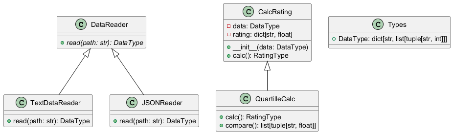

# PTlab1
Добавить класс-наследник класса DataReader, который обрабатывает входные данные из файла в определенном формате (JSON). Реализовать класс для вычисления рейтинга студентов и нахождения студентов в последней квартиле по распределению оценок. Оформить проект, реализовать модульные тесты и создать UML-диаграммы для визуализации архитектуры проекта.

Описание проекта
Проект реализует анализ данных о студентах, включая их оценки по различным предметам. Основные классы:
DataReader: абстрактный класс, который определяет интерфейс для чтения данных.
JSONReader: класс-наследник, который реализует чтение данных из JSON-файла.
CalcRating: класс для расчета среднего рейтинга студентов.
QuartilleCalc: класс, который расширяет CalcRating и добавляет возможность нахождения студентов, попадающих в последнюю квартиль распределения рейтингов.

Используемые языки / библиотеки / технологии
Языки: Python 3
Библиотеки:
pytest: для модульного тестирования
json: для работы с JSON-файлами
Технологии: Git для контроля версий, GitHub для хостинга репозитория.

UML-диаграммa
Диаграмма классов:

Выводы по работе
В ходе лабораторной работы был разработан проект для анализа данных студентов с использованием классов для чтения данных, расчета рейтингов и нахождения студентов с низкими результатами. Были реализованы модульные тесты, покрывающие основные методы классов. Диаграммы классов были созданы для визуализации структуры проекта. Все тесты прошли успешно, проект реализован в соответствии с поставленными задачами.

